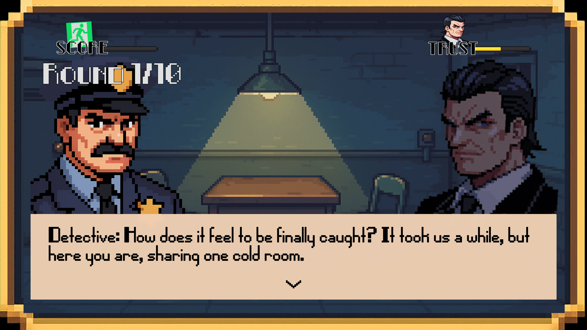

# **Game Title**

## **Code of Silence**

## **How to Run**

- System requirements: Windows 64-bit, Mouse and Keyboard Controls
- Unity Version: 6000.2.6f2
- [**Executable file** of the game to download](https://github.com/mikexql/midterm-gamejam/releases/tag/1.0.2)

## Game Description

**“Code of Silence”** is a short narrative strategy game inspired by the classic *Prisoner’s Dilemma* game theory concept — **reimagined** in a mafia interrogation room.

You and your associate have been captured by the po-po, and he offers to reduce your sentence if you rat on your buddy. If you rat enough, you can even get your sentence reduced completely.

Each round, you decide whether to cooperate (stay silent) or betray. In the actual game theory scenario, the ideal strategy for both would be to cooperate over multiple rounds. However, in this game, cooperation only will not give the you enough `Score` to win, forcing you to betray, otherwise the game ends and you are still imprisoned. The opposing AI makes its own choice based on its `Trust` level.

There are three endings:
- Witness Deal: You gave enough information about your buddy and your sentence is lifted fully at the cost of betrayal. Occurs when `Score` is maxed out at the end of the game.
- Still Imprisoned: You did not betray your buddy enough to get your sentence fully reduced. Occurs when Score is not maxed out at the end of the game.
- **Secret True Narrative Ending**, Take the Fall: You did not give any information at all about your partner and even volunteer to take the fall for him like a **true stand-up guy**. Occurs if the player never chose `Betrayal`

The experience explores the tension between loyalty and survival, framed through a cinematic pixel-art aesthetic.

## Credits

Please credit any work (art form, ideas, etc) you use in this exam.

- AI-generated Sprites: Detective, Main Menu and Game Background, Buttons
- Music:
    - Game Music: https://www.youtube.com/watch?v=cQcq3Gzj7Kw
    - Main Menu Music: https://www.youtube.com/watch?v=3ZCHmli9H1g
- Interesting educational Prisoner's Dilemma Game that gave inspiration: https://ncase.me/trust/